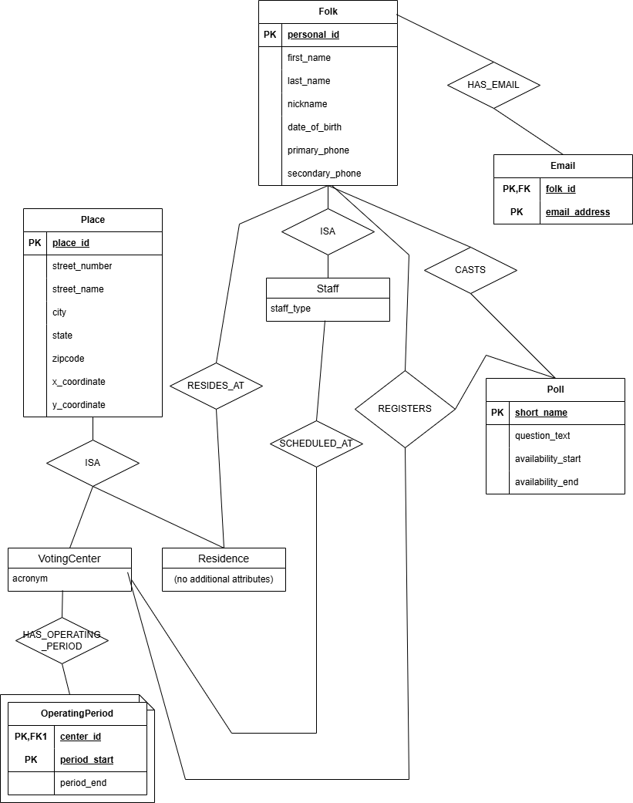

# Elections Database Management System

A comprehensive database application for managing electoral operations, featuring voter registration, poll management, ballot casting, and staff scheduling across multiple voting centers. Built with MySQL, Python, and advanced database design principles.

## Overview

This system handles complete election management operations for a fictional elections department, including real-time voter registration, geographic voting center assignment, ballot casting with ACID transaction compliance, and comprehensive reporting capabilities.

**Key Capabilities:**
- Multi-center voting operations with geographic optimization
- Real-time staff scheduling and voter registration
- Secure ballot casting with transaction isolation
- Interactive data analysis and reporting
- Comprehensive business rule enforcement

## Tech Stack

- **Database:** MySQL with advanced features (triggers, functions, views)
- **Application:** Python, Jupyter Notebook
- **Libraries:** mysql-connector-python, pandas
- **Design:** Normalized relational schema (3NF), ER modeling

## Repository Structure

```
elections-database-system/
├── database/                   # Core database implementation
│   ├── createAll.sql           # Schema creation with constraints & triggers
│   ├── loadAll.sql             # Sample data with geographic precision
│   ├── queryAll.sql            # Complex analytical queries
│   ├── transaction.sql         # ACID-compliant ballot casting
│   └── dropAll.sql             # Database cleanup utilities
├── analysis/                   # Interactive application
│   └── elections_app.ipynb     # Jupyter notebook interface
├── docs/                       # Project documentation
│   ├── ER-diagram.png          # Database design visualization
│   └── project-report.pdf      # Comprehensive documentation
└── README.md
```

## Quick Start

### Prerequisites
- MySQL Server 5.7+
- Python 3.7+
- Jupyter Notebook

### Installation

1. **Clone and setup database:**
   ```bash
   git clone https://github.com/[your-username]/elections-database-system.git
   cd elections-database-system
   
   # Create database
   mysql -u root -p -e "CREATE DATABASE elections_db;"
   
   # Setup schema and data
   mysql -u root -p elections_db < database/createAll.sql
   mysql -u root -p elections_db < database/loadAll.sql
   ```

2. **Launch application:**
   ```bash
   pip install mysql-connector-python pandas jupyter
   jupyter notebook analysis/elections_app.ipynb
   ```

3. **Verify installation:**
   ```bash
   mysql -u root -p elections_db < database/queryAll.sql
   ```

## Key Features

### Database Architecture
- **12 normalized tables** with comprehensive relationships
- **Advanced constraints** including custom validation triggers
- **Geographic functions** for voting center distance calculations
- **Custom SQL functions** for business logic implementation
- **Transaction isolation** with REPEATABLE READ for data consistency

### Business Logic Implementation
- **Voter Registration:** Real-time center availability checking
- **Poll Management:** Dynamic scheduling with ballot validation
- **Staff Scheduling:** Multi-center assignment optimization  
- **Ballot Casting:** ACID-compliant transactions with duplicate prevention
- **Geographic Optimization:** Automatic closest voting center assignment

### Interactive Application
- **Administrative Interface:** Create polls, register voters, manage schedules
- **Query Interface:** Execute complex analytical queries with parameters
- **Data Visualization:** Pandas-powered result formatting and analysis
- **Transaction Management:** Real-time ballot casting with validation

## Database Schema Highlights

**Core Entities:**
- **Folk & Staff:** Hierarchical user management with role-based access
- **Voting Centers:** Geographic locations with coordinate-based optimization
- **Polls & Registrations:** Dynamic scheduling with availability validation
- **Ballots:** Secure casting with transaction isolation and audit trails

**Advanced Features:**
- **Geographic Calculations:** Custom distance functions using coordinate precision
- **Business Rule Enforcement:** Comprehensive trigger system preventing invalid operations
- **Data Integrity:** Multi-level constraint validation with cascading relationships
- **Performance Optimization:** Strategic indexing for complex query operations

## 📊 Database Architecture

The system uses a comprehensive relational design with advanced database engineering concepts:



**Design Features:**
- **ISA Hierarchies:** Folk/Staff and Place/VotingCenter specialization patterns
- **Ternary Relationship:** Complex voter registration (Folk-Poll-Center) modeling  
- **Geographic System:** Coordinate-based distance calculations for center assignment
- **Normalization:** 3NF compliance with optimized relationship structures
- **Advanced Constraints:** Triggers, custom functions, and business rule enforcement

## Example Operations

### Voter Registration with Geographic Optimization
```sql
-- Automatically assigns closest voting center based on coordinates
SELECT get_closest_voting_center('1234567890123456', '2025-03-15') AS assigned_center;
```

### Secure Ballot Casting
```sql
-- ACID-compliant transaction with duplicate prevention
CALL cast_ballot_transaction('voter_id', 'poll_id', 'YES', 1, '2025-03-15', @status, @message);
```

### Complex Analytical Queries
```sql
-- Cross-tabulated voting results with geographic analysis
SELECT vc.center_name, p.poll_question, 
       COUNT(CASE WHEN b.vote_choice = 'YES' THEN 1 END) as yes_votes,
       COUNT(CASE WHEN b.vote_choice = 'NO' THEN 1 END) as no_votes,
       AVG(ST_Distance(vc.coordinates, r.coordinates)) as avg_distance
FROM ballot b
JOIN registration reg ON b.folk_id = reg.folk_id
JOIN voting_center vc ON reg.center_id = vc.center_id
JOIN poll p ON b.poll_id = p.poll_id
JOIN residence r ON b.folk_id = r.folk_id
GROUP BY vc.center_id, p.poll_id;
```

## Testing & Validation

The system includes comprehensive testing:
- **Unit Tests:** Individual function and trigger validation
- **Integration Tests:** End-to-end workflow verification  
- **Performance Tests:** Query optimization and indexing validation
- **Business Logic Tests:** Constraint and validation rule verification

**Sample Test Results:**
- 24 voter registrations across 4 polls and 3 centers
- 18 ballots cast with ACID compliance verification
- Geographic distance calculations with 12.6 decimal precision
- All business rules enforced through trigger validation

## Performance Optimizations

- **Indexing Strategy:** Optimized for complex joins and geographic queries
- **Query Optimization:** Parameterized queries with efficient execution plans
- **Transaction Management:** Minimal lock duration with REPEATABLE READ isolation
- **Geographic Calculations:** Efficient coordinate-based distance algorithms

## System Architecture

**Three-Layer Design:**
1. **Data Layer:** Normalized MySQL schema with business logic enforcement
2. **Application Layer:** Python-based transaction management and validation
3. **Presentation Layer:** Interactive Jupyter notebook with real-time results

**Key Design Principles:**
- **ACID Compliance:** All critical operations use proper transaction isolation
- **Data Integrity:** Multi-level validation through constraints and triggers  
- **Scalability:** Efficient indexing and query optimization for large datasets
- **Maintainability:** Clear separation of concerns with documented interfaces

## Use Cases Demonstrated

**Administrative Operations:**
- Dynamic poll creation with validation
- Real-time voter registration with center optimization
- Staff scheduling across multiple locations
- Ballot modification prevention when voting is active

**Analytical Capabilities:**
- Geographic voting pattern analysis
- Cross-tabulated result reporting
- Distance-based center assignment optimization
- Historical voting trend analysis

## Technical Highlights

This project demonstrates advanced database engineering concepts including:
- **Complex Schema Design** with ISA hierarchies and normalization
- **Advanced SQL** including custom functions, triggers, and views
- **Transaction Management** with proper isolation levels
- **Geographic Data Processing** with coordinate-based calculations
- **Python Integration** for application development
- **Interactive Data Analysis** using Jupyter notebooks

---

**🔗 Connect with me:** [LinkedIn](https://linkedin.com/in/your-profile) | [Portfolio](https://your-portfolio.com)